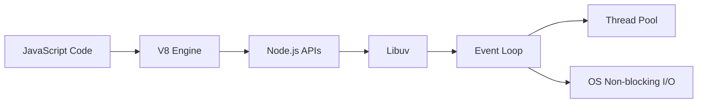

# Node.js Internal Architecture

Node.js is a powerful runtime environment that allows developers to execute JavaScript code server-side. Its architecture is designed for high performance, scalability, and non-blocking I/O operations. Below is an overview of its internal components and how they work together.

---

## 1. Core Components

### a. V8 JavaScript Engine
- Developed by Google for Chrome.
- Compiles and executes JavaScript code to native machine code for fast performance.

### b. Libuv Library
- An open-source C library that provides asynchronous I/O.
- Manages the event loop, thread pool, and handles operations like file system, DNS, networking.

### c. Event Loop
- Heart of Node.js' asynchronous processing.
- Continuously checks for and executes I/O operations, timers, and callbacks.

### d. C++ Bindings
- Node.js core modules are written in C++.
- JavaScript APIs call these C++ functions via bindings.

### e. Node.js APIs
- High-level modules for file system, networking, streams, and more.
- Built on top of V8 and libuv.

---

## 2. How Node.js Works

---

1. **JavaScript Code** is executed by the **V8 Engine**.
2. **V8** interacts with **libuv** for handling asynchronous operations.
3. The **Event Loop** manages all asynchronous tasks and delegates expensive operations to the **Thread Pool**.
4. Non-blocking I/O operations interact directly with the operating system.

---

## 3. Event Loop Phases

Node.js event loop operates in multiple phases:

1. **Timers**: Executes callbacks scheduled by `setTimeout()` and `setInterval()`.
2. **Pending Callbacks**: Executes I/O callbacks deferred to the next loop.
3. **Idle, Prepare**: Internal use.
4. **Poll**: Retrieves new I/O events; executes I/O-related callbacks.
5. **Check**: Executes callbacks scheduled by `setImmediate()`.
6. **Close Callbacks**: Executes close events for sockets, etc.

---

## 4. Thread Pool

- Used for CPU-intensive and blocking operations (e.g., file system, crypto).
- Default size: 4 threads (configurable via `UV_THREADPOOL_SIZE`).
- Ensures main thread remains responsive.

---

## 5. Module System

- Node.js uses CommonJS modules (`require`, `module.exports`).
- Each file is treated as a separate module.

---

## 6. Garbage Collection

- Managed by the V8 engine.
- Automatically frees up unused memory.

---

## References

- [Node.js Official Documentation](https://nodejs.org/en/docs/)
- [https://nodejs.dev/learn/the-nodejs-event-loop](https://github.com/nodejs/node)
- [Libuv Documentation](https://libuv.org/)
